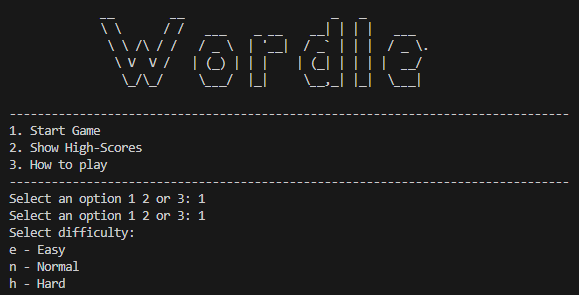

# Wordle Game

The deployed site: [Wordle](https://wordle-ci-569efaee926b.herokuapp.com/)

description

## CONTENTS
* [Introduction](#introduction)
* [Project](#project)
  * [User Goals](#user-goals)
  * [Site Goals](#site-goals)

* [Development](#development)
  * [Initial Flow Chart](#initial-flow-chart)
  * [Features](#features)
    * [Main Menu](#main-menu)
  * [Google Sheets](#google-sheets)

* [Technologies Used](#technologies-used)
  * [Languages Used](#languages-used)
  * [Frameworks, Libraries & Programs Used](#frameworks-libraries--programs-used)

* [Deployment & Local Development](#deployment--local-development)
  * [Deployment](#deployment)
  * [Local Development](#local-development)

* [Testing](#testing)
  * [Bugs](#Bugs)
  
* [Credits](#credits)
  * [Code Used](#code-used)
  * [Content](#content)
  * [Media](#media)
  * [Acknowledgments](#acknowledgments)

- - -
## Introduction

Welcome to our word puzzle game! Here, players are invited to test their word skills by guessing a five-letter word within a limited number of tries. After each guess, you'll receive hints to help you get closer to the correct word. This game is perfect for anyone looking to sharpen their vocabulary and enjoy a fun, brain-teasing challenge. Plus, your guesses and scores get saved, so you can track your progress over time or compete with friends.

## Project

The purpose of this project is simple but impactful:

-To offer an enjoyable and mentally stimulating game that improves vocabulary and problem-solving skills.
-To provide a straightforward platform where users can easily play, review their past guesses, and see their scores.
-To create a user-friendly experience, with data stored and organized efficiently, making it easy for players to revisit and improve their performance.

### User Goals

Players of our game are looking for:

-A fun and engaging way to challenge themselves with word puzzles.
-Easy-to-understand gameplay with immediate feedback on their guesses.
-A way to track their progress and compare scores with others.
-A hassle-free gaming experience that they can jump into anytime.

### Site Goals

My main aims with this site are:

-To deliver an easy-to-use and enjoyable game that keeps players coming back.
-To provide clear and concise instructions, so players know exactly what to do.
-To ensure smooth gameplay with quick access to game data and scores.
-To maintain a flexible platform that can evolve and include more features in the future.

## Development

I started by taking notes and creating a flow chart, which served as my roadmap for coding. This method allowed me to concentrate on coding and perfecting each section individually before moving to the next. My approach was straightforward: follow the notes and the flowchart meticulously, ensuring a clear and focused development process. After ensuring that each section of the code was functioning properly, I proceeded to develop the subsequent section. This sequential approach ensured a smooth progression in the project's development.

### Flow Chart

I have roughly wrote down the flow chart initally by hand and right after starting writing the code made a more detailed version which is shown below (made usig lucid chart).

### Features

#### Guess the Word

In this game, players try to guess a five-letter word. They have a few chances based on the difficulty level they choose. The game gives hints each time they guess. It's fun and also gets you thinking.

#### Three Google Sheets

We use Google Sheets for different parts of the game:

One sheet has 14,000 words that can be the answer.
Another sheet has 2,300 words that players try to guess.
The last sheet keeps track of scores, showing how well players do.
Different Difficulty Levels
Players can choose from three difficulty levels: easy, normal, or hard. This makes the game fun for everyone, whether they just want to relax or are looking for a real challenge.

#### Highscores Tracking

The game records players' high scores. It shows the top scorers, making it exciting to see where you stand among other players.

#### Clear Gameplay

Players get all the instructions they need to play. The game takes them through each step, from entering their name to choosing a difficulty level and starting to guess words.

#### End Game Options

When a game ends, players can either try again or go back to the main menu. This makes it easy to keep playing or take a break.

These features make our game engaging and fun. It's easy to play, and there's always a new challenge waiting for you. Plus, seeing your name on the high score list is a great feeling!

### Google Sheets

For my word puzzle game, I decided to use Google Sheets right from the start. This setup includes three sheets:

Answers Sheet: This has a big list of 14,000 words. These words are used as possible answers in the game, making it more interesting and varied.

Game Words Sheet: It contains 2,300 words. These are the words that players try to guess in the game, offering a good mix of easy and tricky challenges.

Scores Sheet: Here, players' scores are kept track of. It records how well they do in each game, like how many tries they take and how long they spend.

Using Google Sheets from the beginning helped me keep everything organized and made the game work better.

## Technologies Used

### Languages Used

* [Python](https://www.python.org/) - The primary programming language for developing the game.

### Frameworks, Libraries & Programs Used

* [Am I Responsive](https://ui.dev/amiresponsive) To create a mockup of the website image on different platforms/devices.

* [Google Sheets](https://www.google.com/sheets/about/) - Integrated for data management, storing word lists and player scores.

* [gspread](https://gspread.readthedocs.io/en/latest/) - A Python library for Google Sheets interaction, enabling easy data manipulation and retrieval.

* [GitHub](https://github.com/) - Used for version control and to save and store the files for the website.

* [Heroku](https://www.heroku.com/) - Employed for deploying the application, allowing it to be accessible and functional on the web.

* [Lucidchart](https://www.lucidchart.com/) - Used for creating and organizing flowcharts.

* [Visual Studio Code](https://code.visualstudio.com/) - Chosen as the code editor for its efficient coding environment and extensive features.

* [Webpage Spell-Check](https://chrome.google.com/webstore/detail/webpage-spell-check/mgdhaoimpabdhmacaclbbjddhngchjik/related) - a google chrome extension that allows you to spell check your webpage. Used to check the site and the readme for spelling errors.

- - -

## Deployment & Local Development

### Deployment
This project was deployed using Code Institute's mock terminal for Heroku.  [Wordle](https://wordle-ci-569efaee926b.herokuapp.com/)

Steps for deployment:

1. Fork or clone this repository
2. Create a new Heroku app
3. Set the buildbacks to Python and NodeJS in that order
4. Link the Heroku app to the repository
5. Click on Deploy

#### How to Fork

To fork the repository:

1. Log in or sign up on GitHub.
2. Visit the project repository at  [redifo/wordle](https://github.com/redifo/wordle)
3. Click the "Fork" button in the top right corner.

#### How to Clone

To clone the repository:

1. Log in or sign up on GitHub.
2. Go to the project repository at [redifo/wordle](https://github.com/redifo/wordle)
3. Click on the "Code" button, choose whether to clone with HTTPS, SSH, or GitHub CLI, and copy the provided link.
4. Open the terminal in your code editor, navigate to the desired location for the cloned directory.
5. Type 'git clone' in the terminal and paste the link from step 3. Press enter.

## Testing

Please refer to [TEST.md](TEST.md) file for all testing carried out.

### Bugs 

After deciding the code is largly finished with all parts working the initial testing revealed that the input field in the main menu does not work for the first time after completing the game once and returning back to main menu. this was caused due to the input field code being positioned within the print menu function not within the main function.

## Credits

### Code Used

14885 5 letter words were recovered as a .txt file from this directory:
https://gist.github.com/dracos/dd0668f281e685bad51479e5acaadb93

2309 5 letter words were recovered as a .txt file from this directory:
https://dagshub.com/arjvik/wordle-wordlist

The ASCII main menu title was created by using the website and the type selection given in the following url: https://patorjk.com/software/taag/#p=display&h=0&f=Standard&t=Wordle

Overwriting previously printed lines learned from (Used for Making error messages to keep printing on the same line): https://itnext.io/overwrite-previously-printed-lines-4218a9563527 

For writing the sorting algorithm for multiple attribute lists. Used for the top 10 highscores show function sorting.: https://stackoverflow.com/questions/4233476/sort-a-list-by-multiple-attributes

The run game and process guess functions were written through the help of the following tutorials: https://www.youtube.com/watch?v=J6h7D2iQmBU&ab_channel=CompSciwithDr.Victor

Readme.md and Testing.md write structure was written by using my past project as a reference (milestone project 1).

### Acknowledgments

I would like to acknowledge the following people:

* My code institute mentor Jubril Akole for his support and working extra just to have a final meeting with me before the deadline.
